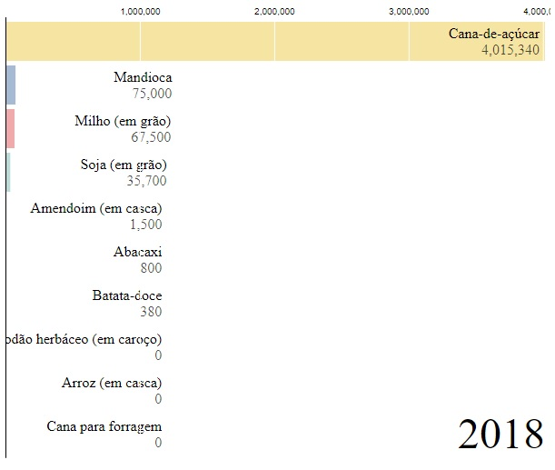

<h1 align="center">Produção Agrícola - IVINHEMA</h1>

<h1 align="center">
   
  
   
</h1>
  
<h2 align="center">Demonstração do Projeto</h2>

 Acesse este link e veja a versão do projeto em execução. :point_right: :point_right: <a href="https://grafico-corrida-ivinhema-producao-agricola-g9ju4t5xk-rtmoresco.vercel.app/">Click Aqui. </a> 

 Este projeto foi desenvolvido utilizando a biblioteca <a href="https://d3js.org/"> D3.js </a> e o <a href="https://observablehq.com/@d3/gallery"> Gráfico de Corrida </a> disponível na sua lista de exemplos.
No corpo do código há uma função javascript que faz uma consulta na API de dados no site do <a href="https://servicodados.ibge.gov.br/api/docs/agregados?versao=3#api-acervo"> IBGE</a>. Os dados são tratados de acordo com os parâmetros exigido pelo código do gráfico de corrida. 

